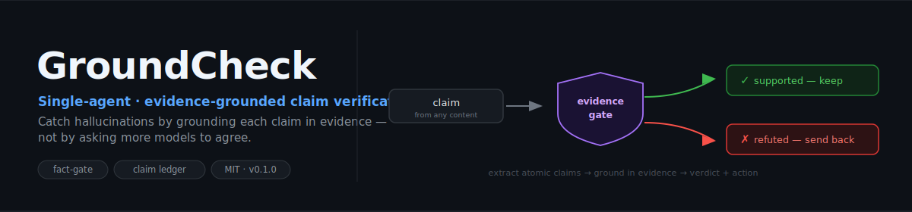

# GroundCheck

<p align="center">
  
</p>

<p align="center">
  <strong>English</strong> · <a href="README.zh.md">中文</a>
</p>

<p align="center">
  
  
  <a href="https://github.com/zhjai/agent-arena"></a>
  <a href="LICENSE"></a>
</p>

> **Single-agent, evidence-grounded claim verification** — catch fabricated facts by checking each claim against real evidence, not by asking more models to agree.

GroundCheck takes content that already exists — a generated answer, a report, RAG output, docs, or code — extracts the verifiable claims, grounds each one in real evidence, and returns a per-claim verdict with citations plus an action: **keep / revise / retract / send back**.

## Why single-agent (and why that matters)

Multi-agent debate is good at fixing **overconfidence** — but it can *reinforce* a shared **hallucination**, because several models trained on similar data confirm the same wrong fact. GroundCheck deliberately does **not** use a panel: it grounds every claim in deterministic external evidence (tests, source, docs, web, retrieved context).

- **GroundCheck** → treats **hallucination** (single-agent + evidence grounding)
- [**agent-arena**](https://github.com/zhjai/agent-arena) → treats **overconfidence** (multi-agent debate)

They form one verification stack at two depths and interoperate via a shared [Claim Ledger](interop/claim-ledger.md).

## What it produces

For each claim: an atomic, classified, dated verdict —
`supported · partially_supported · refuted · unverifiable · outdated · needs_qualification` —
with cited evidence and a recommended action. Compound claims are decomposed so a true
sub-claim can't launder a false bundled conclusion.

The ledger is **contestable, not authoritative**: every verdict is traceable, time-bounded,
and can be reopened with stronger counter-evidence. The verifier can be wrong too.

## Use as a fact-gate in any multi-agent system

GroundCheck is a **generic, pluggable verification gate** — agent-arena, CrewAI, AutoGen,
LangGraph, or any orchestrator can plug it via the [fact-gate contract](interop/fact-gate.md):

```
each agent answers independently
   → PRE-DEBATE gate: groundcheck per answer
       → refuted? send back to that agent (with evidence) before debate
   → debate
   → POST-DEBATE gate: re-check new/changed claims
```

Catching factual errors **before** debate is what stops a panel from reinforcing a shared
hallucination. Send-backs carry **evidence, not conclusions**, and the original answer stays
immutable — so the source agent reasons independently instead of appeasing the checker.

## When to use / not use

**Use:** verify claims · check for hallucinations · "are these citations / numbers / APIs real" ·
fact-check before publishing · RAG groundedness · as a fact-gate in a multi-agent flow.

**Not for:** pure opinions / creative content · code logic already covered by tests ·
"which option is better" decisions (that's agent-arena).

## Install

```bash
npx skills add zhjai/groundcheck -g -a claude-code
```

Works with Claude Code, Codex, Cursor, OpenCode, and other Agent Skills hosts. Or copy
`skills/groundcheck/` into your agent's skills directory.

## Status

`v0.1.0` preview. Not affiliated with any vendor. MIT licensed.
